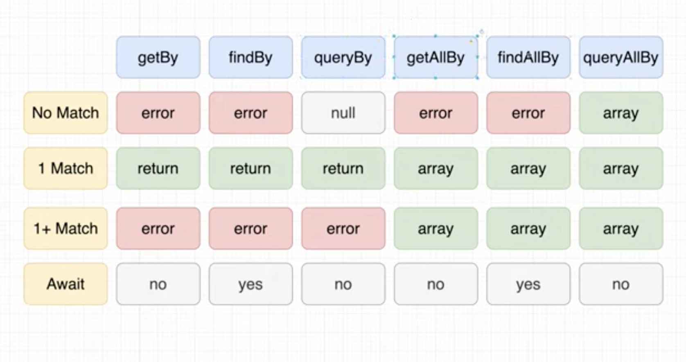

# React Testing Library

## Important Links

- [Official API documentation](https://testing-library.com/docs/react-testing-library/intro/)
- [Playlist Link](https://www.youtube.com/watch?v=n_sS-GAgZ98&list=RDCMUCW5YeuERMmlnqo4oq8vwUpg&index=4)
- [Github Code](https://github.com/harblaith7/React-Testing-Library-Net-Ninja)
- [Types of Queries](https://testing-library.com/docs/queries/about/)
- [Jest lifecycle hooks - youtube link](https://www.youtube.com/watch?v=MtiQMhzjQrY&list=PL4cUxeGkcC9gm4_-5UsNmLqMosM-dzuvQ&index=14)

## What is Unit Testing

Unit testing - test a piece of code / functionality / component in complete isolation. OR to test -

_"the smallest piece of code that can be logically isolated in a system."_

- react testing library

## What is Integration Testing

Integration Tests basically test -

_Hey how are the individual piece of code / components integrating / communicating with one another_

- react testing library
- cypress js

## Rest Testing Library dependencies

```json
"@testing-library/jest-dom": "^5.11.4",
"@testing-library/react": "^11.1.0",
"@testing-library/user-event": "^12.1.10",
```

# Handling Browser Router React Elements

In your daily testing, you'd probably deal with testing react elements that have `react-router-dom` elements inside them.

The `render()` method can be easily modified to meet this requirements

### Example 1:

Creating a **Mocked Test Component** out of your **Test Component** 

```javascript
// TestComponent.test.js
const MockTestComponent = ({ do }) => {
    return (
        <BrowserRouter>
          <TestComponent  do={something}/>
        </BrowserRouter>
    )
}
```

### Example 2:

Creating a reusable higher order function of your `render()` method

```javascript
// RouteHelper.js
import { BrowserRouter as Router } from 'react-router-dom';
import { render } from '@testing-library/react';
import React from 'react';

export function renderWithRouter(ui) {
    return {
       ...render(<Router basename="/">{ui}</Router>)
    };
}

```

## Test Structure

$$
Structure \ of \ a \ Test = \begin{vmatrix}
1. & Render \ a \ component \ we \ need \ to \ test \\
2. & Find \ elements \ we \ want \ to \ interact \ with \\
3. & Interact \ with \ those \ elements \\
4. & Assert \ that \ the \ results \ are \ as \ expected \\ 
\end{vmatrix}
$$

The `Test` block can also be used as `It`

```javascript
test('Test Scenario', () => {});
// OR
it ('Test Scenario', () => {});
```

### Step 1: Render a component we need to test

```javascript
import { render } from '@test-library/react';
...

test('Render a component', () => {
  render(<App/>);
});

```

# Get vs Find vs Query

## 1. Queries: Get.... 

[Link: Types of Queries](https://testing-library.com/docs/queries/about/)

- **Single Elements**
  - `getBy...`: Returns the matching node for a query, and throw a descriptive error if no elements match *or* if more than one match is found (use `getAllBy` instead if more than one element is expected).
  - `queryBy...`: Returns the matching node for a query, and return `null` if no elements match. This is useful for asserting an element that is not present. Throws an error if more than one match is found (use `queryAllBy` instead if this is OK).
  - `findBy...`: Returns a Promise which resolves when an element is found which matches the given query. The promise is rejected if no element is found or if more than one element is found after a default timeout of 1000ms. If you need to find more than one element, use `findAllBy`.
- **Multiple Elements**
  - `getAllBy...`: Returns an array of all matching nodes for a query, and throws an error if no elements match.
  - `queryAllBy...`: Returns an array of all matching nodes for a query, and return an empty array (`[]`) if no elements match.
  - `findAllBy...`: Returns a promise which resolves to an array of elements when any elements are found which match the given query. The promise is rejected if no elements are found after a default timeout of **1000ms**
    - `findBy` methods are a combination of `getBy*` queries and [`waitFor`](https://testing-library.com/docs/dom-testing-library/api-async#waitfor). They accept the`waitFor` options as the last argument (i.e. `await screen.findByText('text', queryOptions, waitForOptions)`)

- All three methods / selectors are part of the `screen` object in react testing library
- 90% of the time we use `getBy...` or `getAllBy..` over `find` ... or `query`



### 1. getByRole, getAllByRole

`getByRole()` takes in a string - "heading" (h1 - h6) / "paragraph" (p)

```javascript
describe("Header", () => {
    it('should render same text passed into title prop', async () => {
        render(
            <Header 
              title="todo"
            />
        );
        const hElement = screen.getByRole("heading");
        expect(hElement).toBeInTheDocument(); // true
    });
});
```

> **NOTE:** getByRole also takes in 2 arguments - to be more specific

#### Example 1: 

The getByRole (with a second parameter - name) applies different for different components. in Headers, for example - it looks for `aria-label` accessor attribute

```javascript
// Header.js
export default function Header({
    title
}) {
    return (
        <>
      			{/*Passing an accessible property - aria-label*/}
            <h1 title="Header" className="header" aria-label='edit'>{title}</h1>
            <h3 data-testid="header-2" className="header">Hello</h3>
        </>
    )
}

// Header.test.js
describe("Header", () => {
    it ('should check if there is a header with an accessible name / description', async () => {
        render(
            <Header 
              title="todo"
            />
        );
      	// Checks for h1 with aria-label
        const hElement = screen.getByRole("heading", {name: /edit/i});
        expect(hElement).toBeInTheDocument(); // true
    });
});
```

#### Example 2:

In buttons for example - it looks for the text of the button

```javascript
// Button.js
...
<button>Text Button</button>
...
// Button.test.js
...
screen.getByRole('button', {
  name: /text button/i
}
...
```

---

> **NOTE:** getByRole, returns `error` if there are multiple headers (>1) with same selector attributes . You need to use `getAllByRole()` instead - which returns an array

```javascript
describe("Header", () => {
    it('should render same text passed into title prop', async () => {
        render(
            <Header 
              title="todo"
            />
        );
        const hElements = screen.getAllByRole("heading");
        expect(hElements.length).toBe(2);
    });
});
```

---

### 2. getByText()

#### Example 1:

The `getByText()` also for instance, has 1 parameter

```javascript
// Button.js
...
<button>Sign up for free</button>
...

// Button.test.js
const button = screen.getByText(/Sign up for free/i);
expect(button).toBeInTheDocument(); // true
```

#### Example 2:

The `getByText()` also takes in a second parameter `{selector: 'button'}`. The following example is more precise test of button component

```javascript
// Button.js
...
<button>Sign up for free</button>
...

// Button.test.js
const button = screen.getByText(/Sign up for free/i, {selector: 'button'});
expect(button).toBeInTheDocument(); // true
```

#### Example 3:

The `getByText()` can also be chained with the `closest('button')` method like so. the following example is JUST as SAME as the above example.

```javascript
// Button.js
...
<button>Sign up for free</button>
...

// Button.test.js
const button = screen.getByText(/Sign up for free/i).closest('button');
expect(button).toBeInTheDocument(); // true
```

# Priority

### Priority Table when using selectors + attributes

|            Testing Priority            |
| :------------------------------------: |
| **Priority 1: Accessible by Everyone** |
|              getByRole()               |
|            getByLabelText()            |
|         getByPlaceholderText()         |
|              getByText()               |
|    **Priority 2: Semantic Queries**    |
|             getByAltText()             |
|              getByTitle()              |
|        **Priority 3: Test ID**         |
|             getByTestID()              |


Based on [the Guiding Principles](https://testing-library.com/docs/guiding-principles), your test should resemble how users interact with your code (component, page, etc.) as much as possible. With this in mind, we recommend this order of priority:

### 1. Queries Accessible to Everyone

> Most (if not all) of your test scripts should be using this category selectors

   Queries that reflect the experience of visual/mouse users as well as those that use assistive technology.

   1. `getByRole`: This can be used to query every element that is exposed in the [accessibility tree](https://developer.mozilla.org/en-US/docs/Glossary/AOM). With the `name` option you can filter the returned elements by their [accessible name](https://www.w3.org/TR/accname-1.1/). This should be your top preference for just about everything. There's not much you can't get with this (if you can't, it's possible your UI is inaccessible). Most often, this will be used with the `name` option like so:`getByRole('button', {name: /submit/i})`. Check the [list of roles](https://developer.mozilla.org/en-US/docs/Web/Accessibility/ARIA/ARIA_Techniques#Roles).
   2. `getByLabelText`: This method is really good for form fields. When navigating through a website form, users find elements using label text. This method emulates that behavior, so it should be your top preference.
   3. `getByPlaceholderText`: [A placeholder is not a substitute for a label](https://www.nngroup.com/articles/form-design-placeholders/). But if that's all you have, then it's better than alternatives.
   4. `getByText`: Outside of forms, text content is the main way users find elements. This method can be used to find non-interactive elements (like divs, spans, and paragraphs).
   5. `getByDisplayValue`: The current value of a form element can be useful when navigating a page with filled-in values.

### 2. Semantic Queries

> Used rarely in cases of - images, area & input elements

HTML5 and ARIA compliant selectors. Note that the user experience of interacting with these attributes varies greatly across browsers and assistive technology.
    
1. `getByAltText`: If your element is one which supports `alt` text (`img`, `area`, and `input`), then you can use this to find that element.

2. `getByTitle`: The title attribute is not consistently read by screenreaders, and is not visible by default for sighted users

### 3. Test IDs

> Should be last priority

   1. `getByTestId`: The user cannot see (or hear) these, so this is only recommended for cases where you can't match by role or text or it doesn't make sense (e.g. the text is dynamic).

```javascript
// Button.js
<button data-testid="test-01">This is a test button</button>

// Button.test.js
const button = screen.getByTestId('test-01');
expect(button).toBeInTheDocument(); // true
```

---

## 2. Queries: Find.... 

the difference between Get vs Find vs Query is in their **return types**

| Get                                                          | Find                                                         | Query                                                        |
| ------------------------------------------------------------ | ------------------------------------------------------------ | ------------------------------------------------------------ |
| `error` if no match / match exceeds more than one (use getAll...) | `error` if no match / match exceeds more than one (use findAll...) | `null` if no match & `error` match exceeds more than one (use queryAll...) |
| Async: false (is synchronous) - no `await`                   | Async: true (is asynchronous) - use `await` and `async` on the test block | Async: false (is synchronous) - no `await`                   |
| Used for static components (without async calls)             | Used for components which load on async calls                | used for negative testing scenarios<br />**not**.toBeInTheDocument(); |

```javascript
import { render, fireEvent, screen } from '@testing-library/react'

test('loads items eventually', async () => {
  render(<Page />)

  // Click button
  fireEvent.click(screen.getByText('Load'))

  // Wait for page to update with query text
  const items = await screen.findAllByText(/Item #[0-9]: /)
  expect(items).toHaveLength(10)
})
```

## 3. Queries: Query...

```javascript
describe("Header", () => {
    it('should not contain any header with text - idiot', async () => {
        render(
            <Header 
              title="todo"
            />
        );
        const hElement = screen.queryByText(/idiot/i);
        expect(hElement).not.toBeInTheDocument(); // true
    });
});
```

# Assertions

The following are some of the popular assertions

- `toBe("test string");` - Check if the test string matches the component
-  `toBeInTheDocument();`- Element to be part of the document object model
- `toHaveClass('active');` - element  to have `className` property values as `active`
- `toBeTruthy()` - Any element which is NOT - null, undefined, 0, false
- `toBeDefined();` - Element to be defined
- `toBeVisible();` - Element to be visible to the user
- `toContainHTML()` - React Element to contain child HTML element
- `toHaveTextContent()` - React Element to contain text content

```javascript
it('"task" should be visible when the number of incomplete tasks is one', () => {
  render(
      <MockTodoFooter 
        numberOfIncompleteTasks={1}
      />
  );
  const pElement = screen.getByText(/1 task left/i);
  // Expect component to be visible to the User, not hidden
  expect(pElement).toBeVisible();
});
```

> NOTE: the `not` operator can be chained to all of the above mentioned assertions for negative testing scenarios

# Fire Events

- [Fire Events - youtube link](https://www.youtube.com/watch?v=0Y11K7KSC80&list=PL4cUxeGkcC9gm4_-5UsNmLqMosM-dzuvQ&index=10)

## Mocking event triggers

You can create fake / dummy event triggers in 2 ways

- **mapping to empty event**

  ```javascript
  <AddInput todos={[]} setTodos={() => {}}/>
  ```

- **creating a mocked event**

  ```javascript
  // mocking event
  const mockEvent = jest.fn();
  
  <AddInput todos={[]} setTodos={mockEvent}/>
  ```

  Both are valid approach to mocking functions event triggers

## Fire Event - Change & Click

```javascript
//mocking event trigger
const mockedSetTodo = jest.fn();

// Using fireEvent - click & change
it('should be able to type into input', () => {
        render(
            <AddInput 
                todos={[]}
                setTodos={mockedSetTodo}
            />
        );
        const inputElement = screen.getByPlaceholderText(/Add a new task here.../i);
        // click fireEvent takes just one parameter
        fireEvent.click(inputElement)
        // change fireEvent takes 2 parameters
        fireEvent.change(inputElement, { target: { value: "Go Grocery Shopping" } })
        expect(inputElement.value).toBe("Go Grocery Shopping");
    });
```

# Integration Tests

- [Integration tests - youtube link](https://www.youtube.com/watch?v=6wbnwsKrnYU&list=PL4cUxeGkcC9gm4_-5UsNmLqMosM-dzuvQ&index=11)

Integration testing is where you test how 2 or more React components interact with one another

Typically your unit testing would be on the **components** folder - individual components

Your integration tests would be the test script of the **view** or the **pages** folder - Views or Screens

#### React Component - Todo

We will be performing integration test on our **Todo** component which has 2 main React components -

- <AddInpt/>
- <TodoList/>

```javascript
// todo.js
import React, { useState } from 'react'
import AddInput from '../AddInput/AddInput'
import Header from '../Header/Header'
import TodoList from '../TodoList/TodoList'
import "./Todo.css"

function Todo() {

    const [todos, setTodos] = useState([])

    return (
        <div className="todo">
            <Header title="Todo" />
            <AddInput 
                setTodos={setTodos}
                todos={todos}
            />
            <TodoList 
                todos={todos}
                setTodos={setTodos}
            />
        </div>
    )
}

export default Todo

```

#### Integration Test

```javascript
// todo.test.js
import { render, screen, fireEvent } from '@testing-library/react';
import Todo from "../Todo"
import { BrowserRouter } from "react-router-dom"

const MockTodo = () => {
    return (
        <BrowserRouter>
          <Todo/>
        </BrowserRouter>
    )
}

const addTask = (tasks) => {
    const inputElement = screen.getByPlaceholderText(/Add a new task here.../i);
    const buttonElement = screen.getByRole("button", { name: /Add/i} );
    tasks.forEach((task) => {
        fireEvent.change(inputElement, { target: { value: task } });
        fireEvent.click(buttonElement);
    })
}

it('should be able to type into input', () => {
    render(
        <MockTodo />
    );
    addTask(["Go Grocery Shopping"])
    const divElement = screen.getByText(/Go Grocery Shopping/i);
    expect(divElement).toBeInTheDocument()
});

// assert multiple query items
it('should render multiple items', () => {
    render(
        <MockTodo />
    );
    addTask(["Go Grocery Shopping", "Go Grocery Shopping", "Go Grocery Shopping"])
    const divElements = screen.queryAllByText(/Go Grocery Shopping/i);
    expect(divElements.length).toBe(3)
});

// checking CSS classes
it('task should not have complete class when initally rendered', () => {
    render(
        <MockTodo />
    );
    addTask(["Go Grocery Shopping"])
    const divElement = screen.getByText(/Go Grocery Shopping/i);
    expect(divElement).not.toHaveClass("todo-item-active")
});

// checking CSS classes
it('task should have complete class when clicked', () => {
    render(
        <MockTodo />
    );
    addTask(["Go Grocery Shopping"])
    const divElement = screen.getByText(/Go Grocery Shopping/i);
    fireEvent.click(divElement)
    expect(divElement).toHaveClass("todo-item-active")
});
```

# Asynchronous Testing - findBy....()

- [Dealing with Async components - youtube link](https://www.youtube.com/watch?v=TBZy-Rc-xX0&list=PL4cUxeGkcC9gm4_-5UsNmLqMosM-dzuvQ&index=13)

When dealing with Components that load due to asynchronous calls to the API. we use the **findBy...()** or the **findAllBy...()** query selectors

```javascript
import {renderWithRouter} from '../../helpers/RouterHelper';
...
// Check single Component
it('should render follow list items', async () => {
        renderWithRouter(<FollowersList />);
        const followerDivElement = await screen.findByTestId(`follower-item-0`);
        expect(followerDivElement).toBeInTheDocument();
});

// Check multiple components
it('should render multiple follow list items', async () => {
        renderWithRouter(<FollowersList />);
        // you can use regular expression to query mutiple components
        const followerDivElements = await screen.findAllByTestId(/follower-item/i);
        expect(followerDivElements.length).toBe(5);
});

```

## Mocking API requests

The following are some of the main reasons, why we should always MOCK api requests

- API requests - cost money
- API requests - are slow
- Your test component now have external dependency
- Not modular... SRP (for reasons above...)
- Not reusable (for reasons above...)

### :triangular_flag_on_post: Hacking React Scripts

> React - by default is resetting our mocks every time.

One way to resolve this (and a bit of a hack)

Navigate to the following folder

> 1. :beetle: node_modules:arrow_right:react-scripts:arrow_right:scripts:arrow_right:utils:arrow_right:createJestConfig
> 2. Goto line # 69
> 3. Overwrite the following to `false`

```javascript
resetMocks: false // Hacking 
```

### :white_check_mark: Overriding Jest Configuration in Package.json

> Another **cleaner** approach is to configure your package.json

```json
 "jest": {
    "resetMocks": false
  }
```

> NOTE: the above configuration only works in a create-react-app project

## Mocking Axios GET request

to mock axios get method directly

- goto your root folder and navigate to the **src** folder. 
- Create a folder name `__mocks__`
- Create the following filename with exact naming convention

```javascript
// __mocks__/axios.js
const mockResponse = {
    data: {
        results: [
            {
                name: {
                    first: "Laith",
                    last: "Harb"
                },
                picture: {
                    large: "https://randomuser.me/api/portraits/men/59.jpg"
                },
                login: {
                    username: "ThePhonyGOAT"
                }
            }
        ]
    }
}


// eslint-disable-next-line import/no-anonymous-default-export
export default {
    get: jest.fn().mockResolvedValue(mockResponse)
}
```

> NOTE: **\_\_mocks\_\_** should be part of your **src** folder


